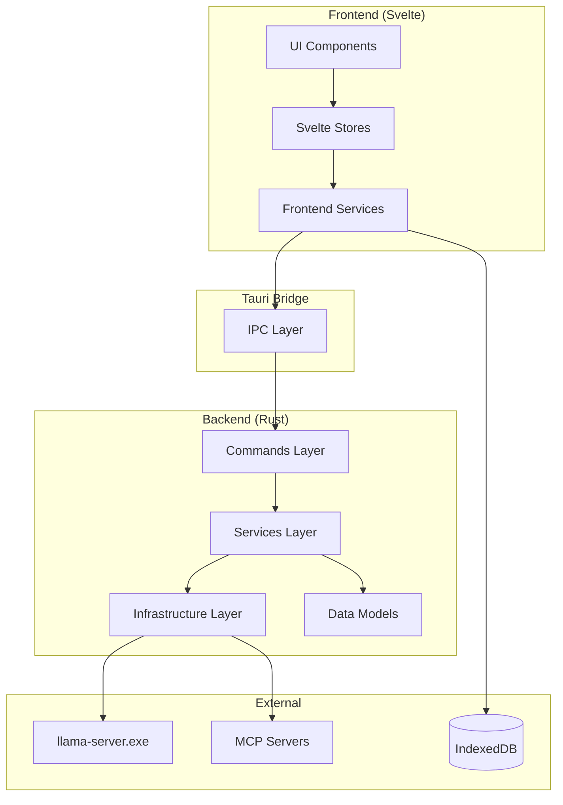
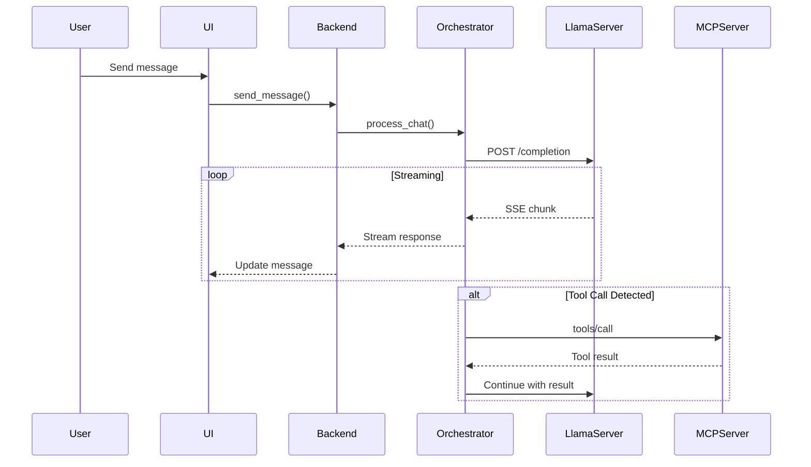
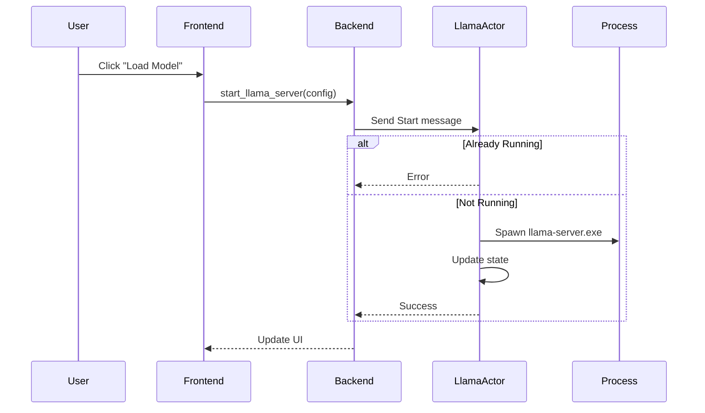
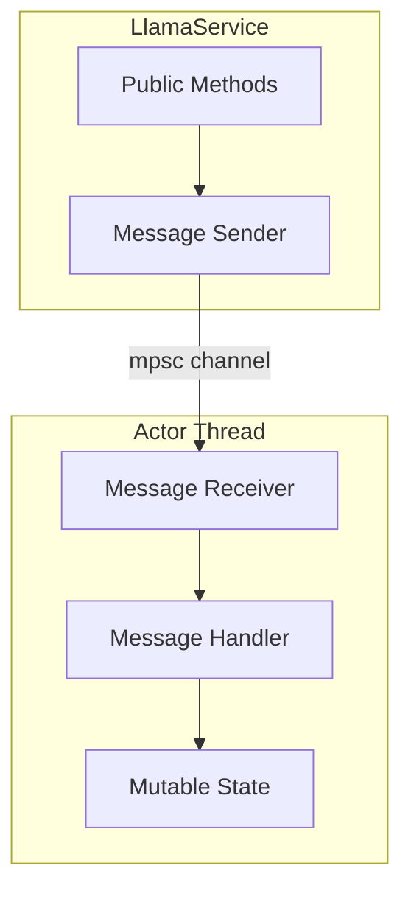

# Architecture Diagrams

Visual representations of the Llama Desktop architecture.

## System Overview

## Chat Flow with MCP Tools

## Model Loading Flow

## State Management (Actor Pattern)

---

*Last updated: 2026-03-28*
