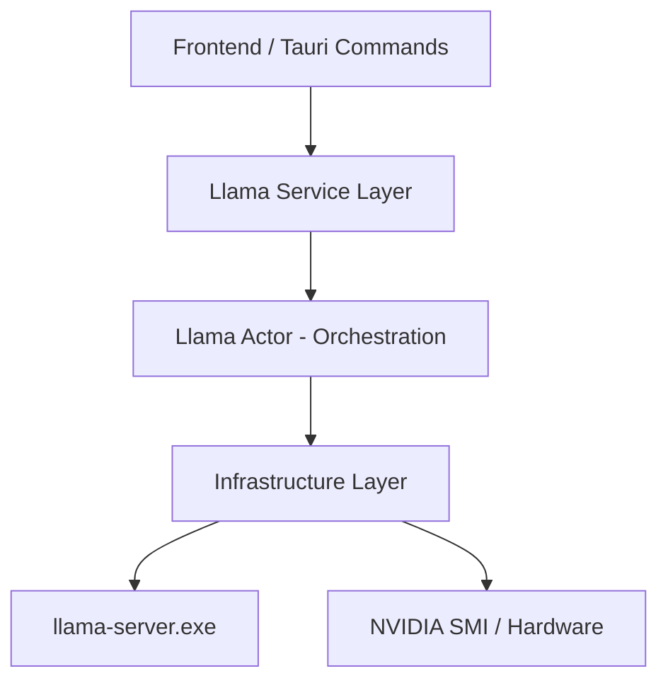

# Backend Architecture: Llama Service

## Purpose
The Llama Service is the core engine of the application, responsible for managing the lifecycle of the local AI model server (`llama-server.exe`), handling real-time chat streaming, and monitoring hardware utilization (CPU and GPU).

## Architecture Overview
The backend follows a layered architecture to ensure separation of concerns between external process management, internal state logic, and data definitions.

## Module Responsibilities

### 1. Infrastructure Layer (`/infrastructure`)
Handles all "side effects" and interactions with the operating system and external binaries.
- **`llama/process.rs`**:
    - Process registry for running `llama-server` children.
    - Start/stop lifecycle utilities for the actor.
- **`llama/server.rs`**: 
    - Spawning and killing the `llama-server` process.
    - Path resolution for binary and model files.
    - Piping process output (stdout/stderr) to application logs.
    - Handling SSE (Server-Sent Events) streaming from the local server.
- **`metrics.rs`**:
    - Snapshot CPU/RAM usage via `sysinfo`.
    - GPU/VRAM usage via `nvidia-smi`.
- **`nvidia_smi.rs`**: 
    - Executing `nvidia-smi` commands.
    - Parsing CSV output to extract GPU load and VRAM usage.

### 2. Service Layer (`/services/llama`)
Acts as the bridge between Tauri commands and internal state.
- **`service.rs`**: 
    - Provides the public `LlamaCppService` interface.
    - Communicates with the Actor via `mpsc` channels.
- **`actor.rs`**: 
    - Implements the Actor Pattern for thread-safe state management (`ModelState`).
    - Orchestrates process lifecycle and metrics via injected infrastructure traits.

### 3. Models Layer (`/models/llama.rs`)
Data specifications used across all layers.
- Defines `LlamaCppConfig`, `ServerMetrics`, `ModelId`, and runtime `ModelState`.
- Ensures consistency in serialization between frontend and backend.

## Public Interfaces (`LlamaCppService`)

| Method | Description |
| --- | --- |
| `start(config)` | Launches the model with specific hardware and context parameters. |
| `stop()` | Gracefully terminates any running model processes. |
| `send_chat_message(...)`| Initiates a streaming chat request to the active model. |
| `get_metrics()` | Returns a snapshot of CPU, RAM, GPU, and VRAM utilization. |
| `is_running()` | Returns the current server status. |

## Implementation Rules
1. **Strict Separation**: Direct IO logic (e.g., `std::process::Command`) must reside in `infrastructure`.
2. **Actor Only State**: Mutable state regarding the server MUST be handled exclusively by the `LlamaActor`.
3. **Data Integrity**: All shared structures must be defined in the `models` layer.
4. **EN-US Only**: All comments, identifiers, and documentation must be in EN-US.
