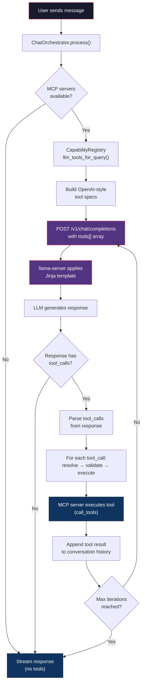
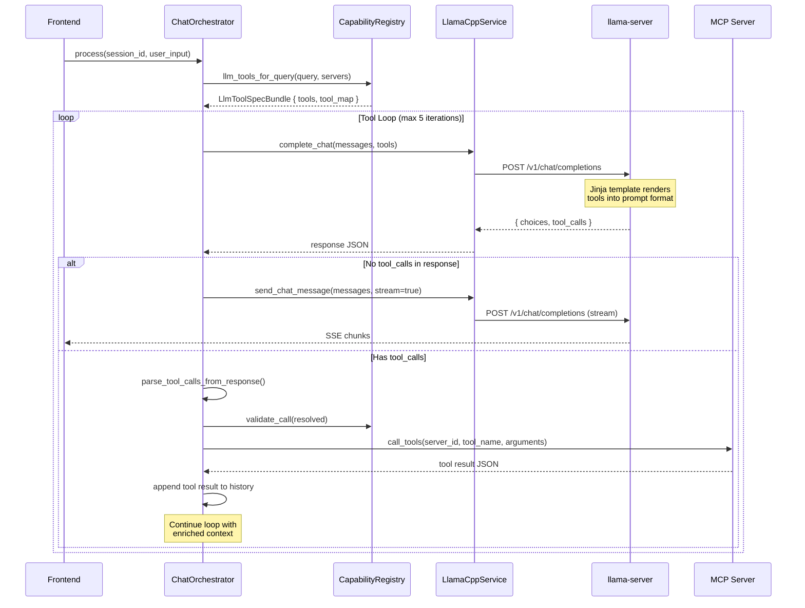
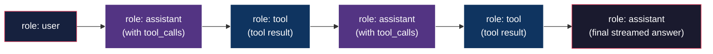

# How to Make MCP / Tool Calling Work with llama.cpp + Jinja

> Architecture reference for the llama.cpp-desktop project.
> Describes the full lifecycle of a tool call — from server startup through Jinja template rendering, LLM inference, tool execution via MCP, and response synthesis.

---

## Table of Contents

1. [Recommended llama-server Configuration](#1-recommended-llama-server-configuration)
2. [Tool Calling Flow Diagram](#2-tool-calling-flow-diagram)
3. [Example: POST /v1/chat/completions with Tools](#3-example-post-v1chatcompletions-with-tools)
4. [Example: Response with tool_calls](#4-example-response-with-tool_calls)
5. [Integration with Existing Code](#5-integration-with-existing-code)
6. [Full Orchestration Loop (Multi-Turn)](#6-full-orchestration-loop-multi-turn)
7. [Tool ID Encoding Convention](#7-tool-id-encoding-convention)
8. [Troubleshooting](#8-troubleshooting)

---

## 1. Recommended llama-server Configuration

### Why `--jinja` Matters

The `--jinja` flag tells `llama-server` to use the model's Jinja2 chat template for formatting messages — including tool definitions and tool call responses. Without this flag, the server falls back to a hardcoded `chatml` template that **does not understand** the `tools` array nor the `tool` role in messages.

### Command Line

```bash
llama-server \
  -m /path/to/model.gguf \
  --port 8080 \
  -c 8192 \
  -np 1 \
  -ngl 99 \
  --jinja \
  --chat-template-file /path/to/cached/template.jinja
```

| Flag                   | Purpose                                                                                                          |
| ---------------------- | ---------------------------------------------------------------------------------------------------------------- |
| `-m`                   | Path to the GGUF model file.                                                                                     |
| `--port`               | HTTP port the server listens on (default: `8080`).                                                               |
| `-c`                   | Context window size in tokens.                                                                                   |
| `-np`                  | Number of parallel slots for concurrent requests.                                                                |
| `-ngl`                 | Number of GPU layers to offload (`-1` = all, `99` = practically all).                                            |
| `--jinja`              | **Required for tool calling.** Enables Jinja2 template rendering.                                                |
| `--chat-template-file` | Path to the `.jinja` file. Use this instead of `--chat-template` (inline string) to avoid shell escaping issues. |

### How the Project Starts the Server

In the infrastructure layer, `LlamaServer::spawn` always passes `--jinja`:

```rust
// src-tauri/src/infrastructure/llama/server.rs — lines 120-129
cmd.arg("--jinja");

if let Some(template) = &config.chat_template {
    cmd.arg("--chat-template").arg(template);
}

if let Some(template_file) = &config.chat_template_file {
    cmd.arg("--chat-template-file").arg(template_file);
}
```

**Constraint:** `chat_template` and `chat_template_file` are mutually exclusive. The server rejects both being set simultaneously.

### Obtaining the Template File (Automatic Cache)

The project automatically downloads and caches template files via the `ensure_hf_chat_template` service:

```rust
// src-tauri/src/services/templates.rs
let template_path = crate::services::templates::ensure_hf_chat_template(
    &app,
    "deepseek-ai/DeepSeek-R1-Distill-Qwen-1.5B",
    None, // defaults to "main" revision
).await?;
// template_path → <app_data>/chat_templates/deepseek-ai_DeepSeek-R1-Distill-Qwen-1.5B.jinja
```

Download strategy (with fallback):

1. `GET https://huggingface.co/{repo}/resolve/{rev}/chat_template.jinja`
2. If 404 → `GET https://huggingface.co/{repo}/resolve/{rev}/tokenizer_config.json` → extracts the `chat_template` field.
3. Result is cached to disk; subsequent calls return immediately.

---

## 2. Tool Calling Flow Diagram

### High-Level Orchestration



### Detailed Request/Response Cycle



### Message Role Flow



---

## 3. Example: POST /v1/chat/completions with Tools

This is the exact shape sent by `LlamaServer::chat_completion` in `src-tauri/src/infrastructure/llama/server.rs`:

```json
{
  "model": "unknown",
  "messages": [
    {
      "role": "user",
      "content": "What is the weather in São Paulo right now?"
    }
  ],
  "tools": [
    {
      "type": "function",
      "function": {
        "name": "mcp__weather__get_current_weather",
        "description": "[weather] Get the current weather for a given location.",
        "parameters": {
          "type": "object",
          "properties": {
            "location": {
              "type": "string",
              "description": "City name, e.g. 'São Paulo, BR'"
            },
            "units": {
              "type": "string",
              "enum": ["celsius", "fahrenheit"],
              "description": "Temperature units. Defaults to celsius."
            }
          },
          "required": ["location"]
        }
      }
    },
    {
      "type": "function",
      "function": {
        "name": "mcp__files__read_file",
        "description": "[files] Read the contents of a file at the given path.",
        "parameters": {
          "type": "object",
          "properties": {
            "path": {
              "type": "string",
              "description": "Absolute path to the file."
            }
          },
          "required": ["path"]
        }
      }
    }
  ],
  "temperature": 0.5,
  "top_p": 0.95,
  "top_k": 40,
  "max_tokens": 1024,
  "stream": false
}
```

### Key Points

| Field                          | Value                  | Why                                                                                                |
| ------------------------------ | ---------------------- | -------------------------------------------------------------------------------------------------- |
| `model`                        | `"unknown"`            | llama-server ignores this — it always uses the loaded model.                                       |
| `stream`                       | `false`                | Tool-calling requests are non-streaming so we can parse the full `tool_calls` array.               |
| `temperature`                  | `0.5` (clamped)        | Lower temp reduces hallucinated tool names. The orchestrator clamps to `min(user_temp, 0.5)`.      |
| `tools[].function.name`        | `mcp__server__tool`    | Encoded ID: `mcp__{sanitized_server}__{sanitized_tool}`. See [§7](#7-tool-id-encoding-convention). |
| `tools[].function.description` | `[server] ...`         | Prefixed with server ID for disambiguation.                                                        |
| `tools[].function.parameters`  | `inputSchema` from MCP | Taken directly from `CapabilityRegistry` cache (via `tools_list`).                                 |

---

## 4. Example: Response with tool_calls

### Standard Response (OpenAI-compatible)

```json
{
  "id": "chatcmpl-abc123",
  "object": "chat.completion",
  "choices": [
    {
      "index": 0,
      "message": {
        "role": "assistant",
        "content": "",
        "tool_calls": [
          {
            "id": "call-0",
            "type": "function",
            "function": {
              "name": "mcp__weather__get_current_weather",
              "arguments": "{\"location\": \"São Paulo, BR\", \"units\": \"celsius\"}"
            }
          }
        ]
      },
      "finish_reason": "tool_calls"
    }
  ],
  "usage": {
    "prompt_tokens": 312,
    "completion_tokens": 48,
    "total_tokens": 360
  }
}
```

### How the Project Parses This

The `parse_tool_calls_from_response` function handles three formats (in priority order):

1. **`message.tool_calls[]`** — Standard OpenAI format (shown above).
2. **`message.function_call`** — Legacy single-function format.
3. **No tool calls** — Plain text response (loop terminates).

The `arguments` field is parsed defensively:

```rust
// src-tauri/src/services/orchestrator.rs — parse_tool_arguments()
match value {
    Value::Object(_) => (value.clone(), true),           // already an object
    Value::String(s) => serde_json::from_str(s)?,        // JSON-encoded string
    Value::Null => (json!({}), false),                   // missing
    _ => (json!({}), false),                             // unexpected type
}
```

### After Tool Execution

The tool result is appended as a `tool` role message:

```json
{
  "role": "tool",
  "content": "{\"temperature\": 28, \"condition\": \"Partly cloudy\", \"humidity\": 65}",
  "tool_call_id": "call-0"
}
```

The loop then re-sends the full conversation (now including the tool result) back to `llama-server` for the next iteration.

---

## 5. Integration with Existing Code

### Step-by-Step: Starting a Server with Tool Support

```rust
use crate::services::templates::ensure_hf_chat_template;
use crate::commands::llama_cpp::start_llama_server_with_service;

// 1. Download/cache the Jinja template
let template_path = ensure_hf_chat_template(
    &app,
    "deepseek-ai/DeepSeek-R1-Distill-Qwen-1.5B",
    None,
).await?;

// 2. Start the server with the template file
let pid = start_llama_server_with_service(
    &state.llama_service,
    "/path/to/llama-server".to_string(),
    "/path/to/model.gguf".to_string(),
    8080,       // port
    8192,       // ctx_size
    99,         // n_gpu_layers
    Some(1),    // parallel slots
    None,       // chat_template (inline — NOT used)
    Some(template_path.to_string_lossy().to_string()), // chat_template_file
).await?;

println!("Server running with PID: {}", pid);
```

### Sending a Tool-Augmented Request

```rust
use crate::services::llama::LlamaCppService;
use crate::models::ChatMessage;

// 1. Build tool specs from MCP registry
let tool_bundle = state.orchestrator
    .registry
    .llm_tools_for_query("search weather", &allowed_servers, 0)
    .await;

// 2. Send non-streaming request with tools
let response = state.llama_service.complete_chat(
    Some("session-123".to_string()),
    vec![ChatMessage {
        role: "user".to_string(),
        content: "What is the weather in São Paulo?".to_string(),
        name: None,
        tool_call_id: None,
        tool_calls: None,
    }],
    0.5,                            // temperature
    0.95,                           // top_p
    40,                             // top_k
    1024,                           // max_tokens
    Some(tool_bundle.tools),        // tools array
    None,                           // tool_choice
).await?;

// 3. Parse tool_calls from the response
// (handled automatically by ChatOrchestrator.process())
```

### Using the Full Orchestrator (Recommended)

For most use cases, use `ChatOrchestrator::process()` directly — it handles the entire tool loop automatically:

```rust
let on_event: Channel<serde_json::Value> = /* from Tauri IPC */;

state.orchestrator.process(
    "session-123",
    "What is the weather in São Paulo?".to_string(),
    0.7,    // temperature
    2048,   // max_tokens
    on_event,
).await?;
// Events emitted:
//   { "thinking": "Tool loop iteration 1" }
//   { "thinking": "Calling MCP tool weather::get_current_weather" }
//   { "thinking": "Tool results injected into context." }
//   { "chunk": "The current temperature..." }  (streamed)
//   { "status": "done" }
```

---

## 6. Full Orchestration Loop (Multi-Turn)

The `ChatOrchestrator` implements a bounded loop with safety guards:

```
┌─────────────────────────────────────────────────────────────────┐
│                    ChatOrchestrator.process()                   │
├─────────────────────────────────────────────────────────────────┤
│                                                                 │
│  1. Extract @mcp: mentions from input                          │
│  2. Resolve allowed MCP servers                                │
│  3. Build tool specs via CapabilityRegistry                    │
│                                                                 │
│  ┌──── Tool Loop (max 5 iterations) ─────────────────────┐     │
│  │                                                        │     │
│  │  4. Send /v1/chat/completions (non-streaming, + tools) │     │
│  │  5. Parse response for tool_calls                      │     │
│  │     ├─ No tool_calls → break, stream final answer      │     │
│  │     └─ Has tool_calls:                                 │     │
│  │        6. Deduplicate (fingerprint = id + args)         │     │
│  │        7. Resolve tool_id → (server_id, tool_name)     │     │
│  │        8. Validate via CapabilityRegistry               │     │
│  │        9. Build/repair arguments from schema            │     │
│  │       10. Execute via McpService.call_tools()           │     │
│  │       11. Append tool result to conversation            │     │
│  │       12. Continue loop                                 │     │
│  │                                                        │     │
│  └────────────────────────────────────────────────────────┘     │
│                                                                 │
│  13. Stream final answer to frontend via SSE events            │
│  14. Append assistant message to session history               │
│                                                                 │
└─────────────────────────────────────────────────────────────────┘
```

### Constants

| Constant                   | Value  | Purpose                                                |
| -------------------------- | ------ | ------------------------------------------------------ |
| `MAX_TOOL_ITERATIONS`      | `5`    | Prevents infinite tool loops.                          |
| `TOOL_CALL_MAX_TOKENS`     | `1024` | Max tokens for tool-calling inference (non-streaming). |
| `TOOL_RESULT_TOKEN_BUDGET` | `512`  | Max tokens retained from each tool result (truncated). |

### Safety Mechanisms

- **Deduplication:** Identical tool calls (same `tool_id` + same `arguments`) are rejected with an error message.
- **Validation:** Every call is validated against the `CapabilityRegistry` before execution.
- **Server allow-list:** Only MCP servers mentioned via `@mcp:server_id` (or all if none mentioned) are available.
- **Budget management:** Messages and tool results are trimmed to fit the context window.
- **Argument repair:** If the LLM produces malformed arguments, `build_arguments_from_query` injects the original user query into the first required string parameter.

---

## 7. Tool ID Encoding Convention

MCP tools are encoded into a single string for the LLM:

```
mcp__{sanitized_server_id}__{sanitized_tool_name}
```

**Sanitization rule:** Any character that is not `[a-zA-Z0-9_-]` is replaced with `_`.

| MCP Server ID | MCP Tool Name         | Encoded Tool ID                     |
| ------------- | --------------------- | ----------------------------------- |
| `weather`     | `get_current_weather` | `mcp__weather__get_current_weather` |
| `my-files`    | `read_file`           | `mcp__my-files__read_file`          |
| `server.v2`   | `search:web`          | `mcp__server_v2__search_web`        |

The `tool_map` in `LlmToolSpecBundle` provides the reverse lookup:

```rust
// tool_map: HashMap<String, (String, String)>
// "mcp__weather__get_current_weather" → ("weather", "get_current_weather")
```

---

## 8. Troubleshooting

### "Model does not generate tool_calls"

| Cause                       | Fix                                                                                                    |
| --------------------------- | ------------------------------------------------------------------------------------------------------ |
| `--jinja` flag missing      | Always passed by `LlamaServer::spawn`. Verify logs: `[Infrastructure] Spawning llama-server at: ...`.  |
| Wrong/missing template      | Check `<app_data>/chat_templates/` for the `.jinja` file. Delete it to force re-download.              |
| Model doesn't support tools | Not all models understand tool calling. Recommended: `Qwen2.5`, `Llama 3.x`, `Mistral`, `DeepSeek-V3`. |
| Temperature too high        | The orchestrator caps it at `0.5` for tool calls. If manually calling, keep it ≤ `0.7`.                |

### "Tool arguments are always empty"

The LLM may produce `"arguments": "{}"` or `"arguments": null`. The orchestrator handles this via `build_arguments_from_query`:

1. Reads `inputSchema.properties` from the cached tool definition.
2. Finds the first `required` parameter of type `string`.
3. Injects the original user query there.
4. Falls back to `{"query": "<user_input>"}`.

### "Server rejects request with both template flags"

The project prevents this at the infrastructure level:

```rust
if config.chat_template.is_some() && config.chat_template_file.is_some() {
    return Err("Use either chat_template or chat_template_file, not both".to_string());
}
```

Use `chat_template_file` with the cached `.jinja` file. Do not set `chat_template` (inline) simultaneously.

### "MCP tool not found in registry"

Run `orchestrator.refresh_capabilities()` after connecting new MCP servers. This is called automatically at startup, but must be triggered manually if the MCP configuration changes at runtime.

---

## Architecture Map (Source Files)

| Layer              | File                              | Responsibility                                                   |
| ------------------ | --------------------------------- | ---------------------------------------------------------------- |
| **Command**        | `commands/llama_cpp.rs`           | Tauri IPC commands: `ensure_chat_template`, `start_llama_server` |
| **Service**        | `services/templates.rs`           | Download + cache Jinja templates from HuggingFace                |
| **Service**        | `services/llama/service.rs`       | Actor-based LLM service: `complete_chat`, `send_chat_message`    |
| **Service**        | `services/orchestrator.rs`        | Full tool-calling loop with MCP integration                      |
| **Service**        | `services/capability_registry.rs` | Cached MCP tool/resource registry with search                    |
| **Service**        | `services/mcp/service.rs`         | MCP client: `connect`, `tools_list`, `call_tools`                |
| **Infrastructure** | `infrastructure/llama/server.rs`  | Process spawning + `--jinja` flag + HTTP health check            |
| **Infrastructure** | `infrastructure/llama/process.rs` | PID registry for child processes                                 |
| **Model**          | `models/chat_model.rs`            | `ChatMessage`, `ChatRequest`, `ChatResponse` structs             |
| **Model**          | `models/llama_model.rs`           | `LlamaCppConfig`, `ModelState`, `ServerMetrics` structs          |
