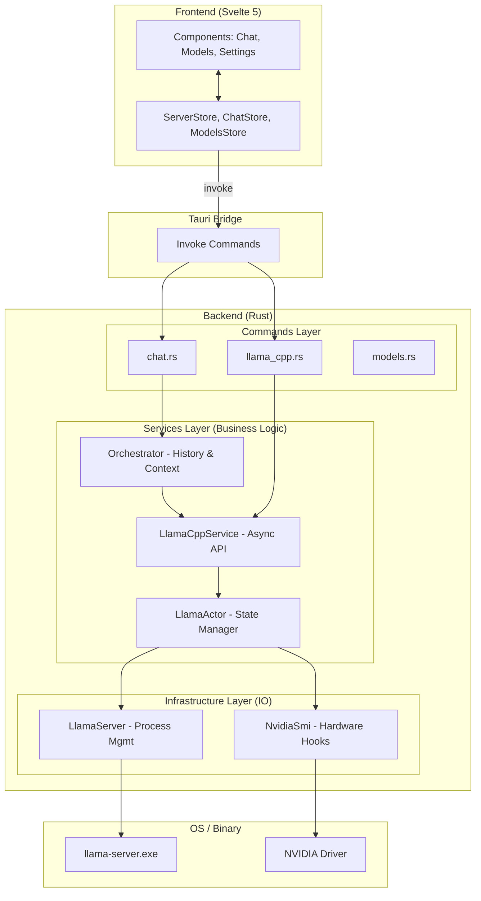

# High-Level Architecture

This document provides a birds-eye view of how the Llama Desktop application components interact, from the Svelte UI to the underlying hardware.

## System Diagram

## Layer Descriptions

### Frontend
- **Components**: Reactive UI elements using Svelte 5 runes.
- **Stores**: Maintain global application state (running status, chat history, metrics) and trigger IPC calls.

### Tauri Bridge (IPC)
- Secure communication channel between the webview and the native Rust backend.

### Backend Logic
- **Commands**: Thin entry points that receive frontend data and delegate to the appropriate service.
- **Orchestrator**: Manages chat sessions, persists history, and injects context into requests.
- **Llama Service (Actor Pattern)**:
    - **Service**: A clonable handle that sends messages to the Actor.
    - **Actor**: A single-threaded state machine that owns the `llama-server` process and ensures thread-safe access to status and metrics.

### Infrastructure
- **LlamaServer**: Handles the "dirty work" of path resolution, process spawning, and piping raw logic to stderr/stdout.
- **NvidiaSmi**: Specific implementation for querying hardware data via CLI.

## Key Data Flows

### 1. Starting a Model
1. **Frontend**: User clicks "Load" on a GGUF model.
2. **Commands**: `start_llama_server` receives config.
3. **Actor**: Transitions to `Starting` state.
4. **Infra**: Resolves the `llama-server.exe` path and spawns the child process.
5. **Actor**: Performs healthcheck pings until `/health` responds 200.
6. **Actor**: Transitions to `Running` and notifies observers.

### 2. Live Telemetry
1. **Frontend**: `ServerStore` triggers a poll every 2 seconds.
2. **Commands**: Calls `get_server_metrics`.
3. **Actor**: 
    - Queries `sysinfo` for CPU/RAM usage of the `llama-server` PID.
    - Queries `NvidiaSmi` for system-wide GPU load.
4. **Frontend**: Updates the `ModelUsageGraph` with new percentages.

### 3. Streaming Chat
1. **Frontend**: User sends a prompt.
2. **Frontend (ChatStore)**: Queries **Dexie DB** for relevant past context (Hybrid Search).
3. **Frontend (ChatStore)**: Injects context into the prompt and calls `send_message` IPC.
4. **Orchestrator**: Appends user message to in-memory session history.
5. **Infra**: Sets up a `reqwest::Client` to stream SSE events.
6. **Frontend**: Receives real-time chunks and updates the UI.
7. **Frontend (ChatStore)**: Persists final response and metadata (model name, tokens) to **Dexie DB**.

