# High-Level Architecture - Llama Server Only

```mermaid
flowchart TB
    subgraph Routes["📍 Routes"]
        R1["/ (+page.svelte)"]
        R2["/settings (+page.svelte)"]
        RL["+layout.svelte"]
    end

    subgraph Components["🧩 Components"]
        direction TB
        subgraph LayoutComponents["Layout"]
            C_Sidebar["ChatSidebar"]
            C_Header["ChatHeader"]
        end
        subgraph ChatUIComponents["Chat UI"]
            C_Form["ChatForm"]
            C_Messages["ChatMessages"]
            C_Message["ChatMessage"]
            C_Orchestrator["ChatOrchestrator"]
        end
        subgraph UIComponents["UI Utilities"]
            C_Avatar["MessageAvatar"]
            C_Typing["TypingIndicator"]
            C_Markdown["MarkdownContent"]
        end
    end

    subgraph Stores["🗄️ Stores (Svelte)"]
        direction TB
        S1["chatStore"]
        S2["modelsStore"]
        S3["settingsStore"]
        
        S1_Methods["<b>chatStore Methods:</b><br/>send(message)<br/>clear()"]
        S1_State["<b>State:</b><br/>messages[]<br/>isLoading<br/>modelLoaded<br/>error"]
        
        S2_Methods["<b>modelsStore Methods:</b><br/>selectModel()<br/>refresh()"]
        S2_State["<b>State:</b><br/>models[]<br/>selectedModel"]
        
        S3_Methods["<b>settingsStore Methods:</b><br/>loadConfig()<br/>saveConfig()"]
        S3_State["<b>State:</b><br/>config<br/>theme"]
    end

    subgraph Frontend["🎨 Frontend Services"]
        F1["ipc.ts<br/>(Tauri IPC)"]
        F2["llama.ts<br/>(Server API)"]
        F3["config.ts<br/>(Config)"]
        F4["models.ts<br/>(Model Utils)"]
    end

    subgraph Backend["⚙️ Backend (Rust/Tauri)"]
        direction TB
        
        subgraph Commands["Commands"]
            CMD1["chat_orchestrator.rs"]
            CMD2["config.rs"]
            CMD3["models.rs"]
        end
        
        subgraph Core["Core Logic"]
            ORCH["ChatOrchestrator<br/>(Slot Management)"]
            ADAPTER["LlamaCppAdapter<br/>(HTTP Client)"]
            SLOT["SlotManager<br/>(Conversation State)"]
        end
        
        subgraph Config["Configuration"]
            CFG["Config<br/>(from .env)"]
        end
    end

    subgraph ProcessMgmt["🔄 Process Management"]
        direction TB
        LAUNCHER["Server Launcher<br/>(Tauri Command)"]
        MONITOR["Server Monitor<br/>(Health Check)"]
        PROCESS["Llama Server Process<br/>(Child Process)"]
    end

    subgraph ExternalServer["🌐 Llama Server"]
        direction TB
        SERVER["Llama Server<br/>(llama.cpp Binary)"]
        API1["/v1/chat/completions"]
        API2["/v1/models"]
        API3["/health"]
    end

    subgraph Storage["💾 Storage"]
        CONFIG["Config File<br/>(app config)"]
        MODELS["Models Directory<br/>(local cache)"]
    end

    %% Routes to Components
    R1 --> C_Orchestrator
    R2 --> C_Header
    RL --> C_Sidebar

    %% Component hierarchy
    C_Orchestrator --> C_Form & C_Messages
    C_Messages --> C_Message
    C_Message --> C_Markdown & C_Avatar
    C_Form --> C_Avatar
    C_Orchestrator --> C_Typing

    %% Components use Stores
    C_Orchestrator --> S1 & S2
    C_Form --> S1 & S2
    C_Messages --> S1
    C_Header --> S2
    C_Sidebar --> S1
    Stores --> S3

    %% Stores use Frontend Services
    S1 --> F1 & F2
    S2 --> F4
    S3 --> F3

    %% Frontend Services to Backend
    F1 --> CMD1 & CMD2 & CMD3
    F2 --> ADAPTER

    %% Backend Core Logic
    CMD1 --> ORCH
    ORCH --> ADAPTER
    ORCH --> SLOT
    CMD2 --> CFG
    CMD3 --> CFG

    %% Backend to Process Management
    CMD1 --> LAUNCHER
    LAUNCHER --> PROCESS
    MONITOR --> PROCESS
    ADAPTER --> MONITOR

    %% Process to Server
    PROCESS --> SERVER
    SERVER --> API1 & API2 & API3

    %% Configuration
    S3 --> CONFIG
    LAUNCHER --> MODELS

    %% Styling
    classDef routeStyle fill:#e1f5fe,stroke:#01579b,stroke-width:2px
    classDef componentStyle fill:#f3e5f5,stroke:#7b1fa2,stroke-width:2px
    classDef componentGroupStyle fill:#e1bee7,stroke:#7b1fa2,stroke-width:1px
    classDef storeStyle fill:#fff3e0,stroke:#e65100,stroke-width:2px
    classDef stateStyle fill:#ffe0b2,stroke:#e65100,stroke-width:1px
    classDef methodStyle fill:#ffecb3,stroke:#e65100,stroke-width:1px
    classDef serviceStyle fill:#e8f5e9,stroke:#2e7d32,stroke-width:2px
    classDef serviceMStyle fill:#c8e6c9,stroke:#2e7d32,stroke-width:1px
    classDef backendStyle fill:#f1f8e9,stroke:#558b2f,stroke-width:2px
    classDef backendMStyle fill:#dcedc8,stroke:#558b2f,stroke-width:1px
    classDef storageStyle fill:#fce4ec,stroke:#c2185b,stroke-width:2px
    classDef apiStyle fill:#e3f2fd,stroke:#1565c0,stroke-width:2px
    classDef externalStyle fill:#fff9c4,stroke:#f57f17,stroke-width:2px
    classDef processStyle fill:#e0f2f1,stroke:#00695c,stroke-width:2px
    classDef processMStyle fill:#b2dfdb,stroke:#00695c,stroke-width:1px

    class R1,R2,RL routeStyle
    class C_Sidebar,C_Header,C_Form,C_Messages,C_Message,C_Orchestrator componentStyle
    class C_Avatar,C_Typing,C_Markdown componentStyle
    class LayoutComponents,ChatUIComponents,UIComponents componentGroupStyle
    class S1,S2,S3 storeStyle
    class S1_State,S2_State,S3_State stateStyle
    class S1_Methods,S2_Methods,S3_Methods methodStyle
    class F1,F2,F3,F4 serviceStyle
    class CMD1,CMD2,CMD3 backendStyle
    class ORCH,ADAPTER,SLOT,CFG backendMStyle
    class Backend backendStyle
    class CONFIG,MODELS storageStyle
    class API1,API2,API3 apiStyle
    class SERVER,ExternalServer externalStyle
    class LAUNCHER,MONITOR,PROCESS,ProcessMgmt processStyle
```



## Architecture Overview

### 🎨 Frontend Layer (Svelte)

**Routes:**
- `/` - Main chat interface
- `/settings` - Application settings

**Components:**
- `ChatOrchestrator` - Main chat container
- `ChatForm` - Message input
- `ChatMessages` - Message display
- `ChatHeader` - Model selector
- `ChatSidebar` - Navigation

**Stores (Svelte Runes):**
- `chatStore` - Chat state and operations
- `modelsStore` - Available models
- `settingsStore` - User settings

### ⚙️ Backend Layer (Rust/Tauri)

**Commands:**
- `chat_orchestrator.rs` - Slot management commands
- `config.rs` - Configuration commands
- `models.rs` - Model management commands

**Core Services:**
- `ChatOrchestrator` - Manages conversation slots
- `LlamaCppAdapter` - HTTP client for llama server
- `SlotManager` - Conversation state management
- `Config` - Environment configuration

### 🌐 Process Management Layer

**Server Launcher:**
- Starts llama server binary
- Manages child process
- Handles startup/shutdown

**Server Monitor:**
- Health checks
- Detects crashes
- Auto-restart on failure

**Llama Server:**
- Runs as child process
- Managed by app
- Provides OpenAI-compatible API

**Endpoints Used:**
- `POST /v1/chat/completions` - Chat completions
- `GET /v1/models` - List models
- `GET /health` - Health check

## Data Flow

### Sending a Message

```
User Input
    ↓
ChatForm.svelte
    ↓
chatStore.send()
    ↓
invokeCommand('send_chat_message')
    ↓
Tauri Backend
    ↓
ChatOrchestrator::handle_user_message()
    ↓
LlamaCppAdapter::chat()
    ↓
HTTP POST /v1/chat/completions
    ↓
Llama Server
    ↓
Response
    ↓
Frontend Display
```

### Streaming Response

```
User Input
    ↓
chatStore.send()
    ↓
invokeCommand('send_chat_message_stream')
    ↓
ChatOrchestrator::handle_user_message_stream()
    ↓
LlamaCppAdapter::chat_stream()
    ↓
HTTP POST /v1/chat/completions (stream: true)
    ↓
Llama Server (SSE Stream)
    ↓
Parse chunks
    ↓
Real-time display
```

## Key Differences from Old Architecture

| Aspect                 | Old                        | New                          |
| ---------------------- | -------------------------- | ---------------------------- |
| **Process Management** | Local llama.cpp process    | App-managed llama server     |
| **Initialization**     | `init_llama()` command     | App launcher command         |
| **Shutdown**           | `shutdown_llama()` command | App shutdown                 |
| **Complexity**         | High (process management)  | Medium (app manages process) |
| **Flexibility**        | Limited to local           | App controls everything      |
| **Scalability**        | Single instance            | Single instance (managed)    |

## Configuration

**Settings File:**
- Stored in app config directory
- Contains user preferences
- Includes server binary path
- Includes model directory path

**Server Configuration:**
- Managed by app launcher
- Port configuration
- Model selection
- Performance parameters

## Dependencies

**Frontend:**
- Svelte 5
- SvelteKit
- Tauri API

**Backend:**
- Tauri 2
- Tokio (async runtime)
- Reqwest (HTTP client)
- Serde (serialization)

**External:**
- Llama Server Binary (llama.cpp)
- OpenAI-compatible API

## Deployment

1. **Configure App:**
   - Set llama server binary path
   - Set models directory
   - Configure port

2. **App Starts Server:**
   - Launches llama-server binary
   - Monitors health
   - Auto-restarts on failure

3. **Use App:**
   - Chat interface ready
   - Server managed automatically

## Future Enhancements

- [x] App-managed server process
- [ ] Server health monitoring
- [ ] Automatic failover
- [ ] Model caching
- [ ] Advanced streaming options
- [ ] Tool/function calling
- [ ] Multiple model support
- [ ] Performance optimization
