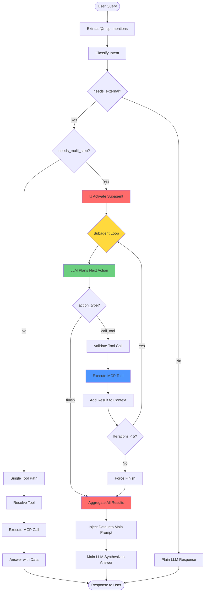

## Key Design Decisions

### 1. **Separate Session Context**
- Subagent uses ephemeral, isolated conversation history
- Main orchestrator never sees the subagent's planning steps
- Only final aggregated results are injected back

### 2. **Agentic Loop Pattern**
```
Loop:
  1. LLM decides: "call_tool" or "finish"
  2. If call_tool: execute → add result to context
  3. If finish: aggregate all results → exit loop
```

### 3. **Safety Limits**
- Max 5 iterations (prevents infinite loops)
- Each action must be valid JSON
- All tool calls are validated against registry
- Results are truncated to fit context window

### 4. **When to Activate Subagent**
The intent classifier detects multi-step needs when:
- Query mentions multiple distinct entities ("weather in Tokyo, NYC, and London")
- Task requires sequential data gathering ("find news, then papers on those topics")
- Results from one tool inform the next call
- LLM explicitly sets `needs_multi_step: true`

### 5. **Result Injection Format**
```
=== EXTERNAL DATA GATHERED ===
Summary: [LLM-generated summary of findings]

Data collected from N tool call(s):
Source 1: tool_name from server_id
Data: {...}

Source 2: ...
=== END EXTERNAL DATA ===
```

This structured format helps the main LLM understand:
- What data was gathered
- Where it came from
- How to synthesize it into an answer
